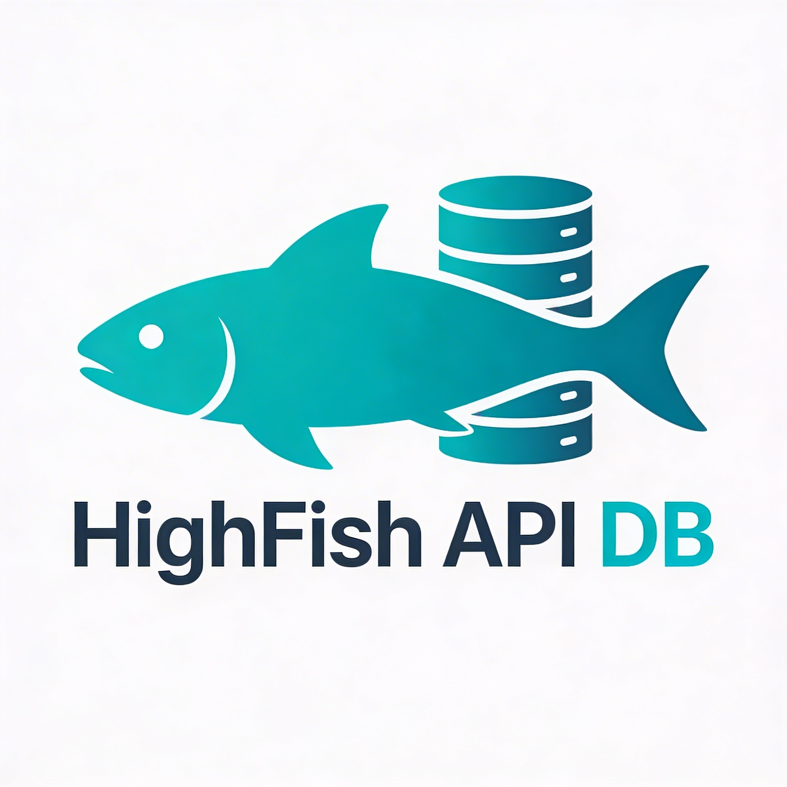

# 🚀 hAI · HighFish Agenten API DB
[](https://github.com/jbkunama1/hAI.highfishAgentenAPIDB)
[](https://github.com/jbkunama1/hAI.highfishAgentenAPIDB)
[](https://github.com/jbkunama1/hAI.highfishAgentenAPIDB)
[](https://github.com/jbkunama1/hAI.highfishAgentenAPIDB)
[](LICENSE)

[](https://www.buymeacoffee.com/highfish)

> Leichtgewichtige SQLite-basierte API-Schluesselverwaltung fuer KI-Agenten-Infrastrukturen – containerisiert, sofort einsatzbereit.



---

## 📚 Inhalt

- [Überblick](#überblick)
- [Features](#features)
- [Schnellstart](#schnellstart)
- [Docker-Deployment](#docker-deployment)
- [API-Referenz](#api-referenz)
  - [Einträge abrufen](#einträge-abrufen)
  - [Eintrag erstellen](#eintrag-erstellen)
  - [Eintrag aktualisieren](#eintrag-aktualisieren)
  - [Eintrag löschen](#eintrag-löschen)
  - [Export](#export)
  - [Import (Text-Format)](#import-text-format)
  - [Health-Check](#health-check)
- [Telegram-Bot](#telegram-bot)
  - [Datenstruktur](#datenstruktur)
- [Umgebungsvariablen](#umgebungsvariablen)
  - [Authentifizierung](#authentifizierung)
- [Lizenz](#lizenz)

---

## 📖 Überblick

**HighFish Agenten API DB** ist ein schlankes Node.js/Express-Backend zur zentralen Verwaltung von API-Endpunkten und API-Keys fuer KI-Agenten (z. B. OpenAI, lokale LLMs, Webhooks). Die Daten werden in einer SQLite-Datenbank gespeichert und ueber eine REST-API exponiert. Ein Web-UI (`index.html`) ist bereits integriert.

---

## 📖 Features

- ✅ CRUD fuer API-Eintraege (Name, URL, API-Key, Notizen)
- ✅ **JSON-Export** aller Eintraege
- ✅ **Text-Import** (semikolongetrennt, Batch)
- ✅ Rate Limiting (100 Anfragen/min pro IP)
- ✅ **Authentifizierung** auf allen API-Endpunkten (Bearer-Token oder Basic Auth)
- ✅ **CI/CD** – automatischer Docker-Build per GitHub Actions (bei Push + manuell)
- ✅ Docker-ready (inkl. Volume-Persistenz, laeuft als non-root)
- ✅ Integriertes Web-UI

---

## 🚀 Schnellstart

```bash
# Repository klonen
git clone https://github.com/jbkunama1/hAI.highfishAgentenAPIDB.git
cd hAI.highfishAgentenAPIDB

# Abhaengigkeiten installieren
npm install

# Entwicklungsserver starten (Port 3000) – mit API-Key absichern
API_KEY=geheimer-schluessel node server.js
```

Aufruf im Browser: `http://localhost:3000`

> Im Web-UI loggst du dich mit deinem **API-Key** ein (der eingegebene Wert wird gegen das Backend geprueft). Setze dafuer vor dem Start die Env-Variable `API_KEY` (sieh [umgebungsvariablen](#umgebungsvariablen)).

---

## 🐳 Docker-Deployment

> ⚠️ Setze in Produktion immer einen **API-Key**, sonst sind die Endpunkte ungeschuetzt (sieh [Authentifizierung](#authentifizierung)).

### Mit docker-compose (empfohlen)

```bash
# Optional: .env-Datei mit Zugangsdaten anlegen
echo "API_KEY=geheimer-schluessel" > .env

docker compose up -d
```

Die Datenbank wird im Volume `highfish-data` persistiert (`/data/highfish.db` im Container). Die Variablen aus `.env` werden von `docker-compose.yml` automatisch uebernommen (`API_KEY`, `AUTH_USER`, `AUTH_PASSWORD`, `ALLOWED_ORIGINS`).

### Manuell

```bash
docker build -t highfish-api-db .
docker run -d \
  -p 3000:3000 \
  -e API_KEY=geheimer-schluessel \
  -v highfish-data:/data \
  --name highfish-api-db \
  highfish-api-db
```

### CI/CD – automatischer Docker-Build

Ein [GitHub Actions Workflow](.github/workflows/docker-build.yml) baut das Image und pusht es bei jedem Push auf `main` sowie manuell nach **GHCR** (`ghcr.io/jbkunama1/hAI.highfishAgentenAPIDB`) als `latest` und Commit-SHA:

- **Automatisch:** bei Push auf `main`
- **Manuell:** *Actions → Docker Build → Run workflow*

### In Portainer

Das GHCR-Image (`ghcr.io/jbkunama1/hai.highfishagentenapidb:latest`) wird vom CI-Workflow gebaut. Fuer Portainer wird ausschließlich die `docker-compose.yml` genutzt.

**Schritt 1 – GHCR-Registry hinterlegen (nur bei privatem Paket)**

1. GitHub → **Settings** → **Developer settings** → **Personal access tokens** → **Fine-grained** → **Generate new token**
   - Repository: `hAI.highfishAgentenAPIDB`
   - Repository permissions → **Packages: Read**
2. Portainer → **Registries** → **Add registry** → **GitHub Container Registry**
   - **URL:** `https://ghcr.io`
   - **Username:** `jbkunama1`
   - **Token:** der erstellte Personal Access Token
3. Speichern

> Ist das Container-Paket **oeffentlich** (`github.com/jbkunama1/hAI.highfishAgentenAPIDB/pkgs/container/hai.highfishagentenapidb` → Settings → Change visibility), entfaellt dieser Schritt.

**Schritt 2 – Stack aus dem Repository anlegen**

1. Portainer → **Stacks** → **Add stack**
2. **Name:** bspw. `highfish-api-db`
3. **Build method:** **Repository**
4. - **Repository URL:** `https://github.com/jbkunama1/hAI.highfishAgentenAPIDB.git`
   - **Ref:** `main`
   - **Compose path:** `docker-compose.yml`
5. **Environment variables** setzen (mindestens `API_KEY`):
   | Variable | Beispiel |
   |----------|----------|
   | `API_KEY` | `dein-geheimer-schluessel` |
   | `ALLOWED_ORIGINS` | `https://api.deine-domain.de` |
   | `AUTH_USER` / `AUTH_PASSWORD` | optional |
6. **Deploy the stack**

**Schritt 3 – pruefen**

- Container innerhalb von ~30 s **healthy** (Healthcheck via `curl /api/health`)
- `curl http://<server-ip>:3000/api/health` → `{"status":"ok",...}`
- `curl http://<server-ip>:3000/api/entries` → `401` ohne API-Key

> **Nach einem Image-Update:** In Portainer beim Stack **Update the stack** klicken, damit der Container das neue `latest`-Image zieht und neu startet.

---

## 🌐 API-Referenz

Basis-URL: `http://<host>:3000`

> **Authentifizierung:** Alle Endpunkte ausser `/api/health` erfordern einen Auth-Header:
> - **Bearer-Token:** `Authorization: Bearer <API_KEY>`
> - **Basic Auth:** `Authorization: Basic base64(Benutzer:Passwort)`
>
> Ohne gueltigen Key antwortet der Server mit `401 Unauthorized`.

> **Authentifizierung:** Alle Endpunkte ausser `/api/health` erfordern einen Auth-Header:
> - **Bearer-Token:** `Authorization: ******
> - **Basic Auth:** `Authorization: Basic base64(Benutzer:Passwort)`
>
> Ohne gueltigen Key antwortet der Server mit `401 Unauthorized`.

---

### Eintraege abrufen

#### Alle Eintraege

```
GET /api/entries
```

**Response:**
```json
[
  {
    "id": 1,
    "name": "OpenAI",
    "url": "https://api.openai.com",
    "apiKey": "sk-...",
    "notes": "GPT-4o",
    "created_at": "2026-06-01T10:00:00.000Z",
    "updated_at": "2026-06-01T10:00:00.000Z"
  }
]
```

#### Einzelner Eintrag

```
GET /api/entries/:id
```

---

### Eintrag erstellen

```
POST /api/entries
Content-Type: application/json
```

**Body:**
```json
{
  "name": "OpenAI",
  "url": "https://api.openai.com",
  "apiKey": "sk-...",
  "notes": "Optional"
}
```

Pflichtfelder: `name`, `url`, `apiKey`

---

### Eintrag aktualisieren

```
PUT /api/entries/:id
Content-Type: application/json
```

**Body:** identisch mit POST

---

### Eintrag loeschen

```
DELETE /api/entries/:id
```

**Response:**
```json
{ "success": true, "message": "Entry deleted" }
```

---

### Export

Exportiert alle Eintraege als JSON-Array (ohne `id`, `created_at`, `updated_at`):

```
GET /api/export
```

**Response:**
```json
[
  { "name": "OpenAI", "url": "https://api.openai.com", "apiKey": "sk-...", "notes": "" }
]
```

---

### Import (Text-Format)

Importiert mehrere Eintraege auf einmal im semikolongetrennten Format.

```
POST /api/import-text
Content-Type: application/json
```

**Body:** Array von Strings im Format `Name;URL;API_KEY;Notizen (optional)`

```json
[
  "OpenWeather;https://api.openweathermap.org;KEY123;Wetterdaten",
  "hAI Agent DB;https://api.highfish.local;ABCDEF;Interne Tests",
  "Groq Cloud;https://api.groq.com;gsk_xxx;Llama3 70B"
]
```

**Response:**
```json
{ "success": true, "imported": 3 }
```

**Hinweise:**
- Zeilen mit fehlendem `name`, `url` oder `apiKey` werden uebersprungen
- `notes` ist optional; mehrere `;` im Notizfeld werden korrekt zusammengefuehrt
- Duplikate werden **nicht** geprueft – bei Bedarf vor dem Import exportieren und bereinigen

---

### Telegram-Bot

Der **HighFish Telegram-Bot** ist ein dedizierter Node.js/Telegraf-Container fuer die Admin-Verwaltung der Datenbank per Telegram-Messenger. Er laeuft separat neben der API und verbindet sich ueber das interne Docker-Netzwerk.

**Setup (docker-compose):**

| Variable | Beispiel | Beschreibung |
|----------|---------|-------------|
| `TELEGRAM_BOT_TOKEN` | `123456:ABC-...` | BotFather Token |
| `ADMIN_TELEGRAM_ID` | `123456789` | Deine Telegram-User-ID |
| `API_KEY` | `geheimer-schluessel` | Muss mit API-Server-Key uebereinstimmen |

**Funktionen:**

| Button | Beschreibung |
|--------|-------------|
| `List` | Gibt alle DB-Eintraege formatiert aus |
| `Search` | Freitext-Suche in Name + Notizen |
| `Export DB` | Vollstaendiger JSON-Export aller Eintraege |
| `Import` | JSON-Array senden zum Importieren |

**Admin-Schutz:** Jede eingehende Nachricht wird gegen `ADMIN_TELEGRAM_ID` geprueft. Unbefugte erhalten eine `Unauthorized`-Antwort.

**Docker:**
```bash
docker compose up -d highfish-telegram-bot
```

---

### Health-Check
GET /api/health
```

**Response:**
```json
{ "status": "ok", "timestamp": "2026-06-12T10:00:00.000Z" }
```

---

## 🏗️ Datenstruktur

Tabelle: `api_entries`

| Spalte | Typ | Beschreibung |
|--------|-----|--------------|
| `id` | INTEGER (PK, AUTO) | Automatische ID |
| `name` | TEXT (NOT NULL) | Anzeigename des Dienstes |
| `url` | TEXT (NOT NULL) | API-Endpunkt-URL |
| `apiKey` | TEXT (NOT NULL) | API-Schluessel |
| `notes` | TEXT | Optionale Notizen |
| `created_at` | DATETIME | Erstellungszeitpunkt |
| `updated_at` | DATETIME | Letzte Aenderung |

---

## 🛠️ Umgebungsvariablen

| Variable | Standard | Beschreibung |
|----------|----------|--------------|
| `PORT` | `3000` | HTTP-Port des Servers |
| `DB_PATH` | `./data/highfish.db` (dev) / `/data/highfish.db` (prod) | Pfad zur SQLite-Datei |
| `NODE_ENV` | – | `production` aktiviert den Docker-Datenpfad |
| `API_KEY` | – | API-Key fuer Bearer-Token-Authentifizierung (empfohlen) |
| `AUTH_USER` / `AUTH_PASSWORD` | – | Alternativ: Basic-Auth-Zugangsdaten |
| `ALLOWED_ORIGINS` | `http://localhost:3000` | Kommagetrennte CORS-Whitelist |

### Authentifizierung

Alle `/api`-Routen ausser `/api/health` sind **geschuetzt**. Setze mindestens eine der folgenden Optionen:

**Option 1 – Bearer-Token:**
```bash
API_KEY=geheimer-schluessel
# Anfrage:
curl -H "Authorization: Bearer geheimer-schluessel" http://localhost:3000/api/entries
```

**Option 2 – Basic Auth:**
```bash
AUTH_USER=admin
AUTH_PASSWORD=geheim
# Anfrage:
curl -u admin:geheim http://localhost:3000/api/entries
```

**Wichtig:** Ohne gesetzten `API_KEY`/`AUTH_*` sind die Routen weiterhin offen. Setze die Variablen in Produktion immer! In `docker-compose.yml` werden die Variablen bereits aus der lokalen `.env` uebernommen.

---

## 📄 Lizenz

MIT – sieh [LICENSE](LICENSE)

---

*Teil der **hAI · HighFish** Infrastruktur – selbstgehostete KI-Agenten-Verwaltung.*
